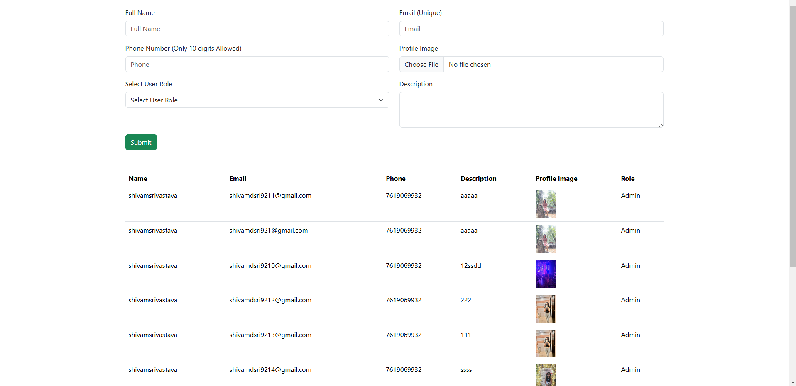

## Project Overview
This project demonstrates a form submission feature in Laravel 11.x with JavaScript, including client-side and server-side validations and dynamic data display without page reloads. 

## Features
- **Form Fields**:
  - Name (text)
  - Email (text)
  - Phone (text)
  - Description (textarea)
  - Role ID (dropdown selection)
  - Profile Image (file upload)
- **Validations**:
  - Email format validation.
  - phone number validation (10 digits).
- **No page reload**: Form submission and data display without refreshing the page using JavaScript.
- **Role Model Relation**: Associating `User` with `Role`.

## Prerequisites
- PHP (version 8.1 or higher)
- Laravel  11.x
- Composer
- Git

## Screenshots

### User Information



## Installation Guide
1. **Clone the Repository**:
   ```bash
   git clone https://github.com/ShivamSrivastava76/dreamcast-test.git
   cd dreamcast-test
   ```

2. **Install Composer Dependencies**:
   ```bash
   composer install
   ```

3. **Install JavaScript Dependencies**:
   ```bash
   npm install
   npm run dev
   ```

4. **Set Up Environment Variables**:
   - Copy the `.env.example` file to `.env`:
     ```bash
     cp .env.example .env
     ```
   - Update the `.env` file with your database credentials and other necessary configurations.

Run Migrations and Seeders:
5. **Run Migrations and Seeders:**:

   ```bash
  php artisan migrate --seed
   ```

6. **Run the Development Server**:
   ```bash
   php artisan serve
   ```


### Display Data Without Reload
- JavaScript and AJAX are used  to submit the form and refresh the data shown on the page without a full page reload.
